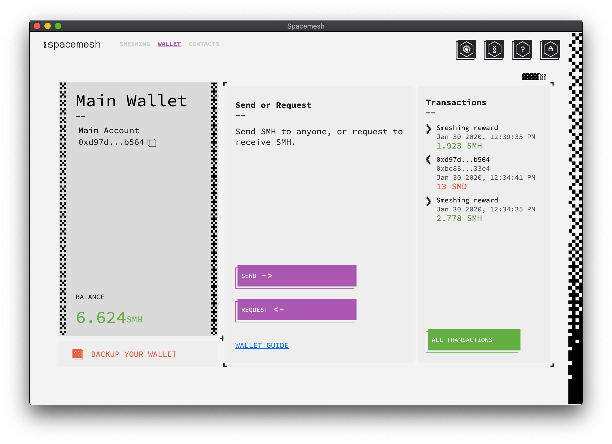

# Using the Spacemesh Wallet

The Spacemesh App includes a wallet for managing your Spacemesh Coins.

Follow the instructions on this page to learn how to use your wallet.

## Accessing your wallet

A new wallet is created when you open the Spacemesh App for the first time.

You were prompted to secure your wallet with a password which we recommended you store in your `password manager app` such as [1Password](https://1password.com).

> Your wallet data is saved in a `wallet file` on your hard drive. The `wallet file` includes sensitive private data which is encrypted in the file with your password.

When you open the Spacemesh App again you should see this screen:

Enter your Wallet password to unlock access to your wallet.

> The Wallet data is loaded from the wallet file end decrypted using your provided password.

> IMPORTANT: you will lose access to your wallet if you forget your password. This is the reason we recommend you to create a 12 words backup as soon as possible. See [Wallet Backup](#)

## Checking your Spacemesh Coin Balance

After unlocking your wallet with your password, you should see the wallet screen:

Your wallet is configured with one main account called `Main Account`. Think of this account as your crypto bank account number. You use this account to hold Spacemesh Coins and to send and receive Spacemesh Coins.

Your account balance is displayed at the bottom-left side of the screen:

Each address has a friendly name (In this case it is `public address`) and a unique set of numbers similar to a unique bank account checking account number.

Your balance is displayed below the public address. SMC is the symbol for Spacemesh Coins. In the image above, the public address as 6.9998 Spacemesh Coins. The estimated USD value of your balance is displayed above the SMC balance amount.

?> You can copy the address to your computer's clipboard by clicking on the copy icon next to the address. You can also create additional addresses in your wallet at any time.

## Sending Coins
Follow [this guide](send_coin.md)

## Getting Coins
Follow [this guide](get_coin.md)

## Locking Access

?> When you are done using the wallet in the App you should `log out` from it to prevent other people with access to your computer from viewing your coin balance, perform transactions or view your transactions history.  

To log-out from you wallet, just click on `Log Out` in the main menu in the App main screen, or just close the App main window by clicking on the close button of the main App Window.

To log-in again to your wallet, open the app and click on the Wallet command in the left side of the screen. You will need to enter your wallet passphrase again to access your wallet.

## Backing up and restoring from backup
- Follow [this guide](backup.md)

# Advanced Features

## Creating a new address

By default your wallet is pre-configured with one main address. This suffices for performing basic transactions and for receiving awards.

?> Your wallet main address is the address that appears in your wallet card in the app:

You can add up to 256 additional addresses to your wallet.

Each new address has its own coin balance, a friendly name, a display name and a private signing key.

Follow these steps to create a new address:
1. Go to the settings screen
2. Click `New Address`
3. Optionally name your new address

The address info is saved in the wallet file.  

You can freely switch between addresses, view the coin balance of any address, send coin from any address, or receive coin to any address.   

## Creating additional wallets

By default, you use one wallet (with one public address).

You can create additional wallets. Each wallet has its own passphrase, wallet data file and one or more addresses.

To create a new wallet, click on 'New Wallet' command in the settings screen.

You will be prompted to name your new wallet and to provide a passphrase for securing it.

!> Do not use a passphrase you already used for a wallet for your new wallet.
